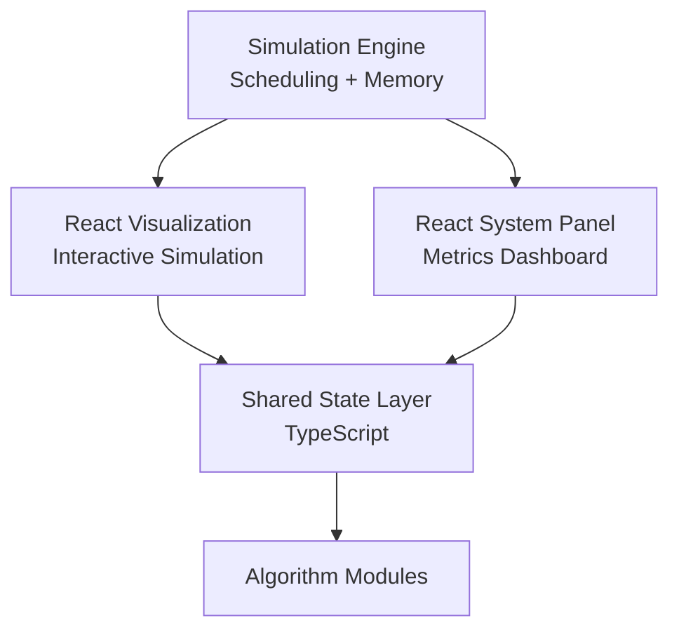
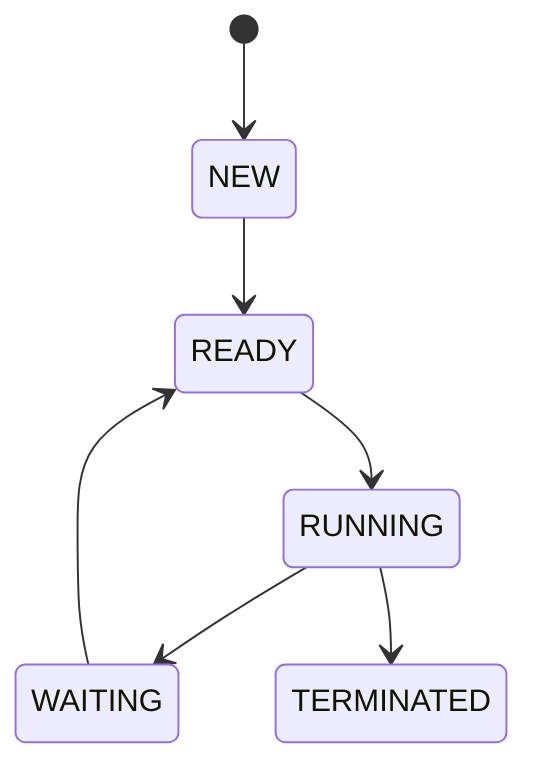
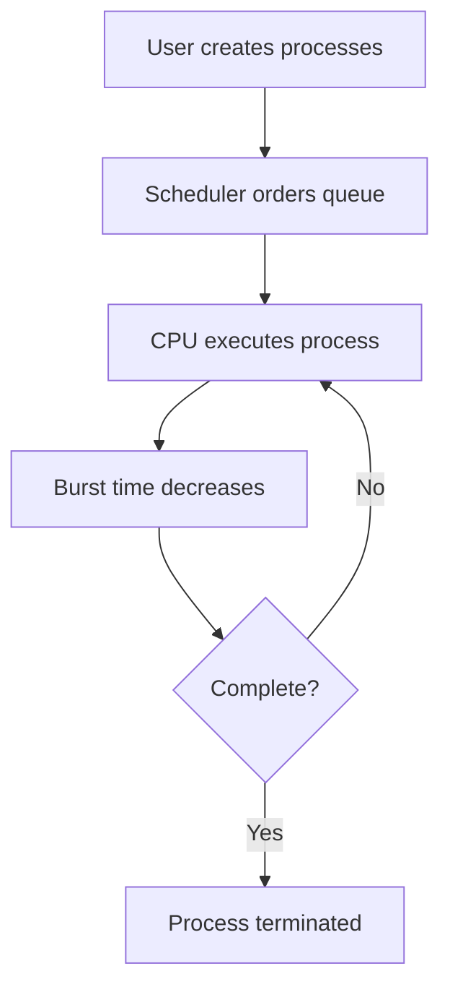
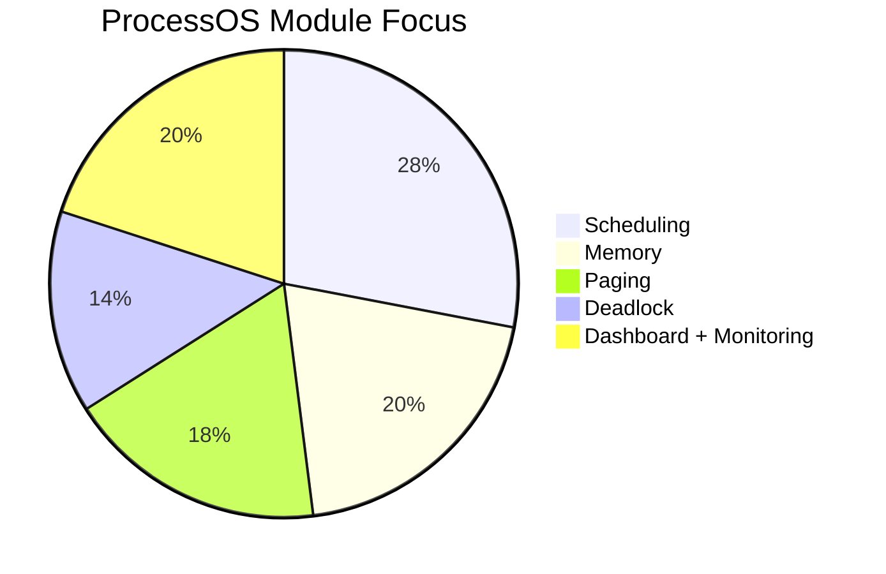
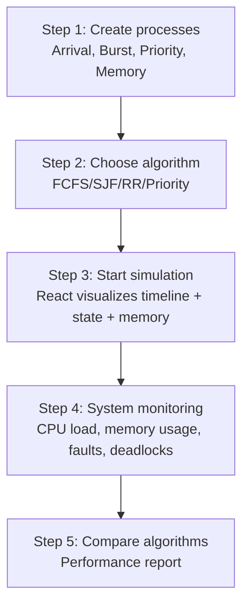
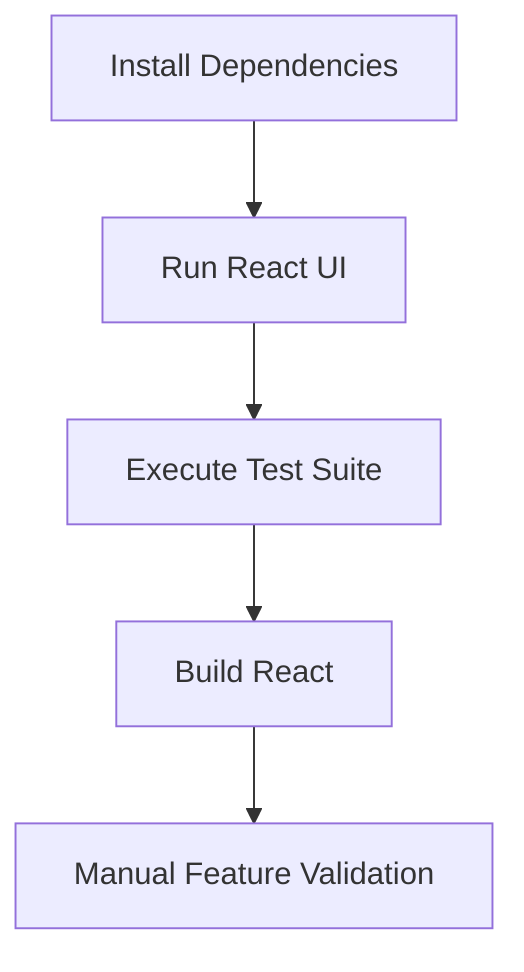

# ProcessOS - Interactive Operating System Simulator

## Goal

ProcessOS is an interactive platform that allows users to simulate, visualize, and compare operating system process scheduling and memory management algorithms in real time.

It helps students and developers understand OS behavior visually, similar to how real operating systems manage processes.

## Real-World Problem It Solves

Most operating system learning is theoretical.

- Students memorize scheduling algorithms.
- They cannot visualize how CPU scheduling happens in practice.
- They cannot observe memory fragmentation, deadlocks, or page faults in real time.

ProcessOS solves this by providing a live simulation engine where users can:

- Create processes
- Run scheduling algorithms
- Observe memory allocation
- Detect deadlocks
- Compare algorithm performance

## System Architecture



Key idea:

- React focuses on visual simulation.
- React dashboard focuses on system monitoring and analytics.

## Core Modules

### 1. Process Manager

Handles creation and lifecycle of processes.

Features:

- Create process
- Edit parameters
- Delete process
- State transitions

Process attributes:

- PID
- Arrival Time
- Burst Time
- Priority
- Memory Requirement
- State

State machine:



Data structures:

- Queue
- Priority Queue

### 2. CPU Scheduling Engine

Responsible for executing scheduling algorithms.

Supported algorithms:

| Algorithm | Concept |
|---|---|
| FCFS | First Come First Serve |
| SJF | Shortest Job First |
| Round Robin | Time Quantum scheduling |
| Priority Scheduling | Highest priority first |

Example flow:



Data structures used:

- Queue
- Min Heap (SJF)
- Circular Queue (Round Robin)
- Priority Queue

### Module Coverage Chart



### 3. Gantt Chart Visualizer (React)

Animates process execution timeline.

Features:

- Live execution timeline
- Color-coded process blocks
- Time quantum animation
- Step-by-step playback

Implementation idea:

- Canvas API / SVG rendering
- Frame updates every `500ms`
- Process blocks drawn dynamically

### 4. Memory Allocation Simulator

Simulates memory allocation strategies.

| Algorithm | Description |
|---|---|
| First Fit | First available block |
| Best Fit | Smallest sufficient block |
| Worst Fit | Largest available block |

Visualization concept:

```text
|P1|P2|Free|P3|Free|P4|
```

Shows:

- Fragmentation
- Allocation failures
- Memory usage

### 5. Page Replacement Engine

Handles virtual memory simulation.

| Algorithm | Concept |
|---|---|
| FIFO | First page replaced first |
| LRU | Least recently used |
| Optimal | Replace page used farthest in future |

Metrics tracked:

- Total references
- Page faults
- Hit ratio
- Fault ratio

Visualization:

```text
Frame 1 | Frame 2 | Frame 3
```

### 6. Deadlock Detection System

Implements resource allocation graph and safety checks.

Concepts used:

- Banker's Algorithm
- Cycle detection (graph theory)

Graph structure:

```text
Process -> Resource -> Process
```

If cycle exists -> deadlock detected.

Options:

- Terminate process
- Resource preemption

Data structure:

- Graph
- DFS cycle detection

## System Monitor Dashboard

Acts like a mini task manager.

Modules:

- Process Table
	- PID
	- State
	- CPU%
	- Memory
- CPU Utilization Graph (`Time -> CPU%`)
- Algorithm Comparison Tool

Outputs:

- Average Waiting Time
- Average Turnaround Time
- CPU Utilization
- Throughput

## Workflow



## Algorithms Used

| Feature | Algorithm |
|---|---|
| Scheduling | FCFS, SJF, RR, Priority |
| Memory | First Fit, Best Fit, Worst Fit |
| Virtual Memory | LRU, FIFO, Optimal |
| Deadlock | Banker's Algorithm |
| Graph Detection | DFS cycle detection |

## Tech Stack

Frontend:

- React (Simulation Engine UI)
- TypeScript
- Canvas API
- Chart.js / D3.js

Implemented in this repository as:

- React simulator app at root (`src/`) using TypeScript + Canvas (`GanttChart`) + Chart.js/D3 (`CPUUtilizationChart`).
- Shared TypeScript contracts at `shared/types/`.

Optional backend (future extension):

- Node.js
- Express
- REST API
- SQLite

## Recommended Folder Structure

```text
processOS/
	frontend-react/
		components/
		gantt-chart/
		scheduler/
		memory-visualizer/
		deadlock-graph/

	core-engine/
		scheduling/
		memory/
		deadlock/
		paging/

	shared/
		models/
		types/
```

## SDLC Implementation

1. Requirement Phase: Define simulation scope.
2. Design: Finalize architecture and UI flows.
3. Implementation: Build algorithm modules and visual layers.
4. Testing: Validate round robin correctness, deadlock detection, page-fault accuracy.
5. Iteration: Improve performance, UI quality, and algorithms.

## Local Setup and Installation

### Prerequisites

- Node.js `>=18`
- npm `>=9`

### Installation

```bash
npm install
```

### Configuration Details

Current repository requires no `.env` file for local execution. The simulation engine runs fully on client-side TypeScript modules.

For production/full-stack extension, recommended environment keys are:

```bash
# Suggested for future backend integration
API_BASE_URL=http://localhost:4000
WS_BASE_URL=ws://localhost:4000
```

### Run React Simulation UI

```bash
npm run dev
```

### Run Tests

```bash
npm run test
```

### Build for Production

```bash
npm run build
```

### Run Full Verification

```bash
npm run verify:all
```

### Full Command Matrix

| Purpose | Command |
|---|---|
| Run React simulator UI | `npm run dev` |
| Run tests | `npm run test` |
| Build React app | `npm run build` |
| Verify everything | `npm run verify:all` |

## Code Structure (Actual Repository)

```text
PLACEMENT/
	src/                        # React simulation UI
		components/
		context/
		engine/
		pages/
		test/
	shared/
		types/                    # Shared TypeScript contracts
	README.md
	architecture.md
	projectdocumentation.md
```

## Usage Instructions

1. Add process data: arrival time, burst time, priority, memory.
2. Select a scheduling algorithm.
3. Execute simulation.
4. Observe Gantt timeline, process transitions, and memory behavior.
5. Open monitoring dashboard for CPU/memory/fault/deadlock metrics.
6. Compare algorithms using the same workload and review reports.

## Execution Verification Flow



## Execution Timeline Chart

```mermaid
gantt
	title Typical Simulation Session
	dateFormat  X
	axisFormat %L
	section User Flow
	Create Processes        :a1, 0, 2
	Choose Algorithm        :a2, after a1, 1
	Execute Simulation      :a3, after a2, 2
	Analyze Charts/Metrics  :a4, after a3, 2
	Compare Algorithms      :a5, after a4, 2
```



Validation checklist:

- Scheduling module runs all configured algorithms.
- Memory module reflects allocation/deallocation correctly.
- Paging module reports hit/fault metrics correctly.
- Deadlock module reports banker result and cycle-check output.
- All tests pass and production build succeeds.

## Dashboard Chart Modules

- Line chart: CPU utilization trend (Chart.js)
- Doughnut chart: Active vs idle CPU share (Chart.js)
- Bar chart: Key metric comparison (Chart.js + D3 scaling)
- Algorithm comparison bars and process monitor panels

## Advanced Features (Future Scope)

- Multi-core CPU simulation (e.g., 4 cores)
- Cloud deployment (Vercel/Netlify)
- Save simulation reports (PDF/CSV)
- Collaborative simulation rooms

## Resume Description

**ProcessOS - Interactive Operating System Simulator**

Tech Stack: React, TypeScript, Canvas API

- Built a full-stack OS simulator visualizing CPU scheduling, memory allocation, and deadlock detection in real time.
- Implemented FCFS, SJF, Round Robin, and Priority scheduling using queue-based data structures.
- Developed animated Gantt chart visualizations to display process execution timelines.
- Simulated virtual memory using FIFO, LRU, and Optimal page replacement algorithms.
- Built an integrated React dashboard for live CPU utilization monitoring and scheduling algorithm comparison.

## Why This Project Is Strong

It demonstrates:

- Operating systems depth
- Data structures and algorithms
- React + TypeScript engineering
- Visualization skills
- System design thinking
- Practical problem solving

## Documentation Files

- `README.md`
- `architecture.md`
- `projectdocumentation.md`

## Implementation Status Note

- Implemented now: React simulator/dashboard + shared TS contracts.
- Next extension: backend API + persistence + real-time sync.
