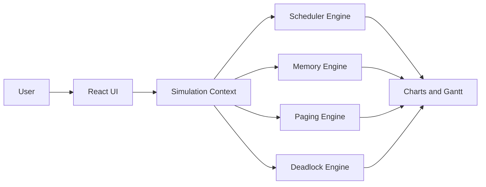
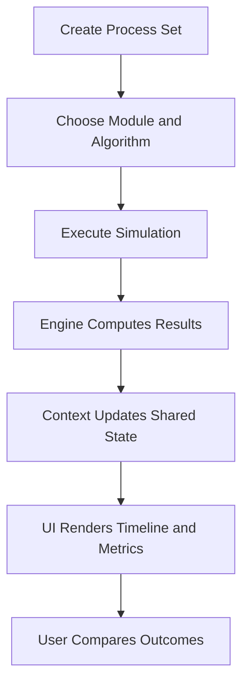
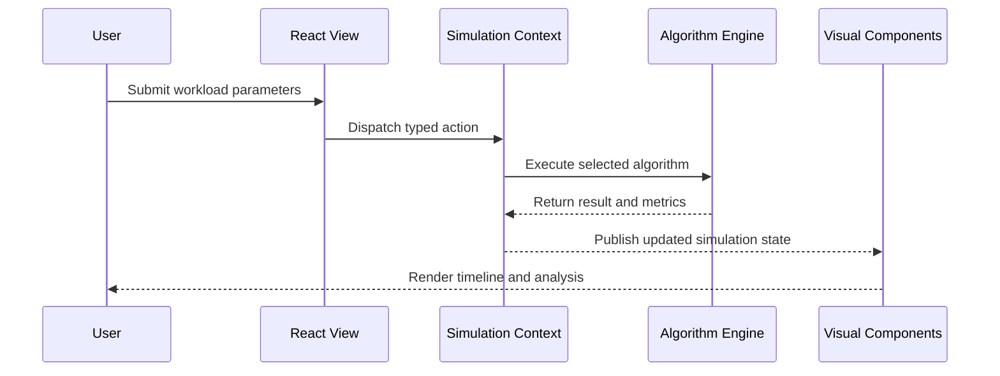
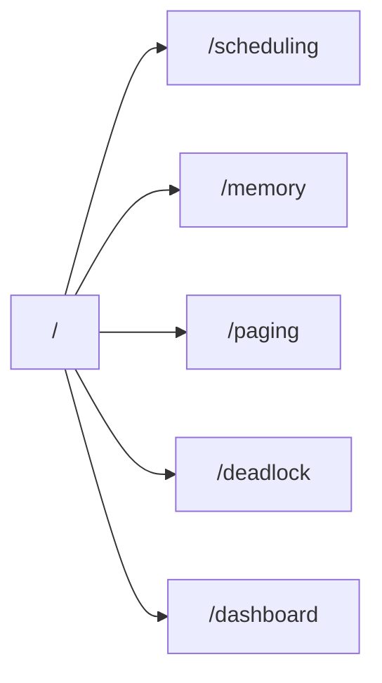
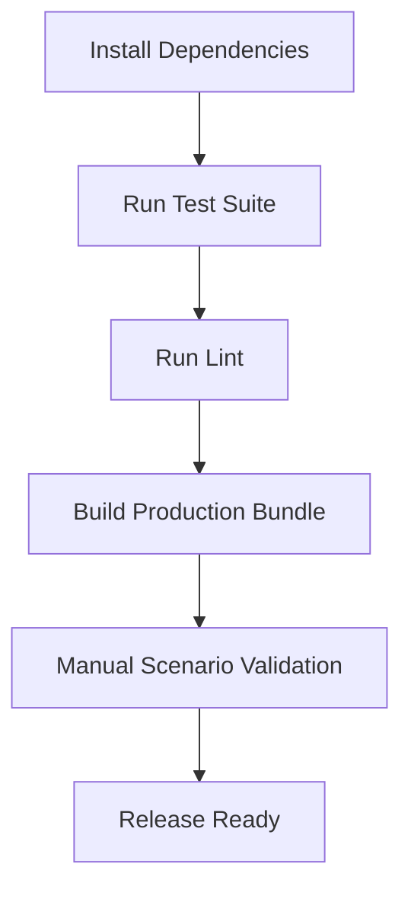

# ProcessOS

Interactive Operating System Simulator built to explain scheduling, memory, paging, and deadlock behavior with live visual feedback.

## Project Overview

ProcessOS transforms OS theory into an interactive simulator where users can create workloads, run classic algorithms, and inspect outcomes through Gantt timelines, metrics panels, and monitoring charts.

Primary goals:
- Make operating system concepts tangible and visual
- Keep algorithm execution deterministic and testable
- Provide a clean, scalable frontend architecture for future full-stack expansion

## Experience Snapshot

| Area | What You Get |
|---|---|
| Scheduling | FCFS, SJF, Round Robin, Priority |
| Memory Allocation | First Fit, Best Fit, Worst Fit |
| Page Replacement | FIFO, LRU, Optimal |
| Deadlock | Safety and cycle detection simulation |
| Visualization | Gantt animation, process table, health charts |
| Quality | Type-safe contracts, test suite, lint checks |

## System Map



## Tech Stack

| Layer | Technology | Why It Was Chosen |
|---|---|---|
| Frontend | React 18 + TypeScript | Component model + strong type safety |
| Build Tooling | Vite 5 | Fast dev server and production build performance |
| Styling | Tailwind CSS + shadcn/ui + Radix | Rapid UI composition with consistent primitives |
| Visualization | Chart.js + react-chartjs-2 + D3 | Practical charting with flexible data transforms |
| State/Fetching | React Context + React Query | Shared state + predictable async boundaries |
| Testing | Vitest + Testing Library | Fast unit/component coverage |
| Quality | ESLint | Static checks for maintainability |

## Folder Organization

```text
PLACEMENT/
  public/
  shared/
    types/
      simulation.models.ts
  src/
    components/
      layout/
      ui/
    context/
    engine/
    hooks/
    lib/
    pages/
      modules/
    test/
    App.tsx
    main.tsx
    index.css
  architecture.md
  projectdocumentation.md
  README.md
  package.json
```

## Workflow



## Execution Flow Diagram



## Route-Level Navigation Flow



## Local Setup and Installation

### Prerequisites
- Node.js `>=18`
- npm `>=9`

### Install Dependencies

```bash
npm install
```

### Run Development Server

```bash
npm run dev
```

### Build Production Artifacts

```bash
npm run build
```

### Run Test Suite

```bash
npm run test
```

### Run Lint Checks

```bash
npm run lint
```

### Full Verification Pipeline

```bash
npm run verify:all
```

## Command Matrix

| Goal | Command |
|---|---|
| Start local app | `npm run dev` |
| Execute tests | `npm run test` |
| Run lint checks | `npm run lint` |
| Build for production | `npm run build` |
| End-to-end verification | `npm run verify:all` |

## Usage Instructions

1. Open the app and navigate to a simulation module.
2. Add process inputs such as arrival time, burst time, priority, and memory demand.
3. Select an algorithm.
4. Run the simulation.
5. Inspect Gantt timeline, metrics, and charts.
6. Switch algorithms for the same workload and compare results.

## Verification Flow



## Scope Clarity

Current implementation:
- Frontend simulator
- Algorithm engines
- Shared types
- Automated tests and build pipeline

Not currently implemented:
- Backend API server
- Database persistence

## Documentation Index

- `README.md`: onboarding, setup, usage, execution visuals
- `architecture.md`: architecture model, design rationale, integration map
- `projectdocumentation.md`: complete engineering documentation and validation strategy
