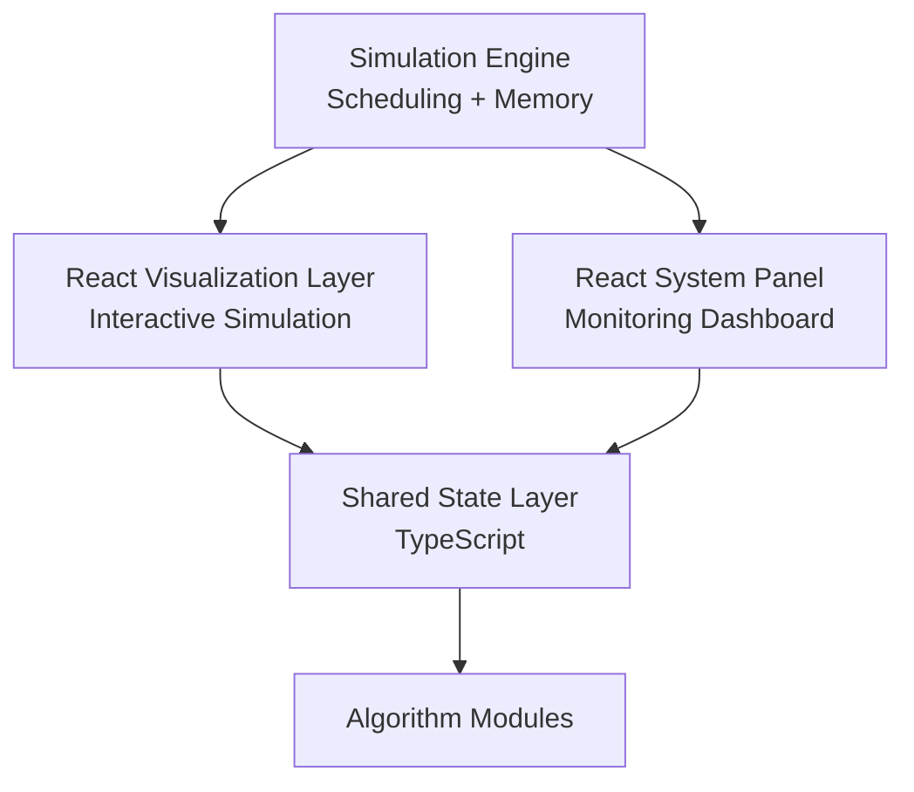
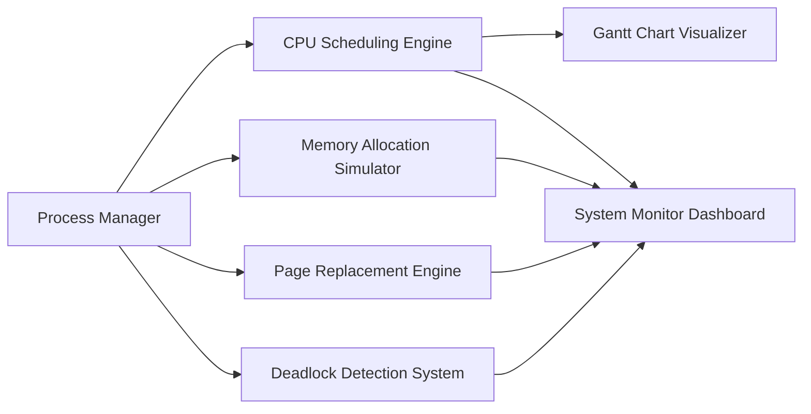
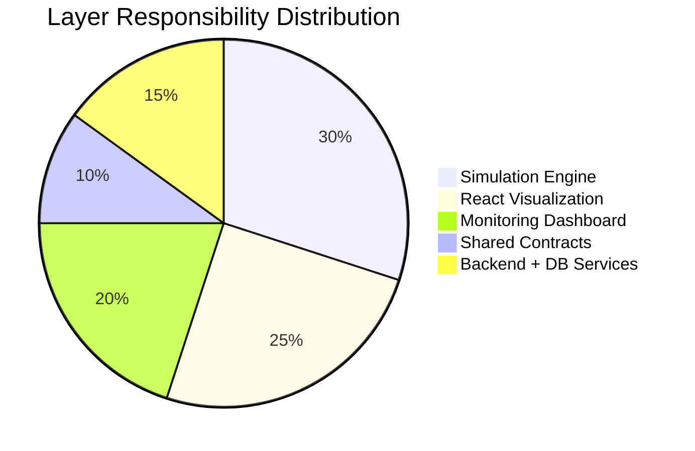
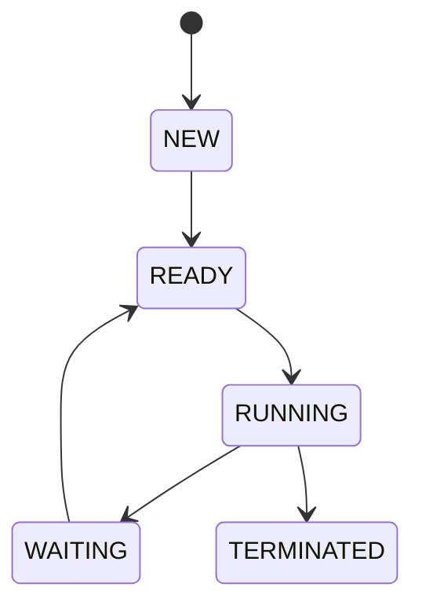
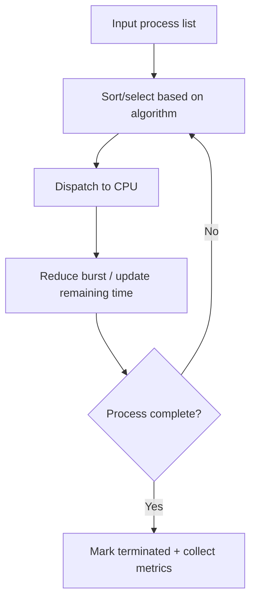
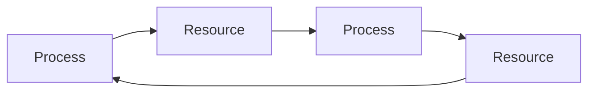
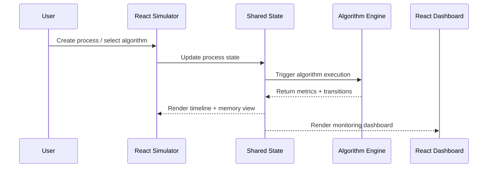
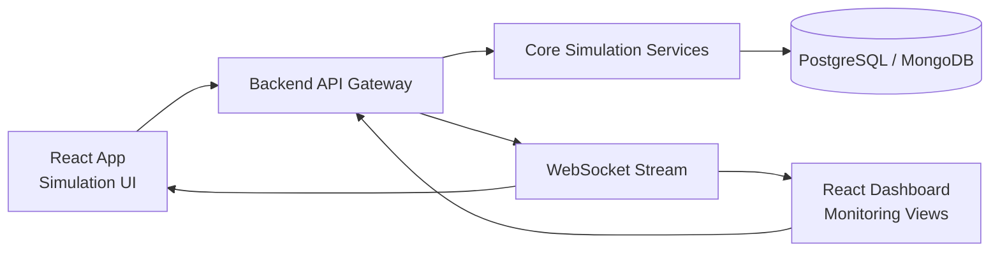

# ProcessOS - Architecture Documentation

## 1. Main Idea and Objective

ProcessOS is an interactive operating system simulator designed to visualize process scheduling and memory management behavior in real time.

Core objective:

- Bridge the gap between OS theory and practical understanding through live visual simulation.

## 2. High-Level System Architecture

Architecture intent:

- React: simulation and animated visualization.
- React dashboard: monitoring and analytics.
- Shared state (TypeScript): common models and synchronized execution state.

## 3. Layer-Wise Responsibilities

### Simulation Engine Layer

- Executes scheduling and memory operations.
- Emits state transitions and metrics.

### React Visualization Layer

- Renders process timelines and memory visuals.
- Handles process creation and playback controls.

### System Monitoring Panel

- Displays live system health (CPU, memory, faults, deadlock alerts).
- Provides algorithm comparison views.

### Shared State Layer

- Keeps process/memory metrics consistent across UI layers.
- Defines unified interfaces and event payloads.

### Algorithm Modules Layer

- Encapsulates scheduling, memory, paging, and deadlock logic.

## 4. Core Module Architecture

## Module Responsibility Distribution

## 5. Process Manager Design

Responsibilities:

- Create, edit, and delete processes.
- Track lifecycle state transitions.

Attributes:

- PID
- Arrival Time
- Burst Time
- Priority
- Memory Requirement
- State

State machine:

Data structures:

- Queue
- Priority Queue

## 6. CPU Scheduling Engine Design

Supported algorithms:

- FCFS
- SJF
- Round Robin
- Priority Scheduling

Data structures:

- Queue
- Min Heap (SJF)
- Circular Queue (RR)
- Priority Queue

Execution flow:

## 7. Gantt Chart Visualizer (React)

Design goals:

- Live execution timeline
- Color-coded process segments
- Time quantum animation
- Step-by-step playback

Implementation style:

- Canvas API or SVG-based timeline rendering
- `500ms` frame updates

## 8. Memory Allocation Simulator

Algorithms:

- First Fit
- Best Fit
- Worst Fit

Tracks:

- Fragmentation
- Allocation failure
- Overall memory usage

## 9. Page Replacement Engine

Algorithms:

- FIFO
- LRU
- Optimal

Metrics:

- Total references
- Page faults
- Hit ratio
- Fault ratio

## 10. Deadlock Detection System

Techniques:

- Banker's algorithm
- Resource allocation graph cycle detection
- DFS traversal

Graph model:

If cycle exists, system flags deadlock and suggests:

- Process termination
- Resource preemption

## 11. Monitoring Dashboard (React)

Views:

- Process table (`PID`, `State`, `CPU%`, `Memory`)
- CPU utilization graph (time-series)
- Algorithm comparison report

Comparison outputs:

- Average waiting time
- Average turnaround time
- CPU utilization
- Throughput

## 12. Data Flow and Integration

## 13. Deployment Topology (Target)

Current repo status:

- Frontend applications and simulation engines are implemented.
- Backend/API/DB layer is implemented in `backend/` (Express + SQLite).

## 14. Shared Contract Design

Shared TypeScript contracts live under `shared/types/` to keep UI and backend models aligned.

Contract priorities:

- Single source of truth for process snapshots and metrics.
- Stable payload shape across UI and service boundaries.
- Backward-compatible schema evolution.

## 15. Implemented Backend and Database Design

Backend stack:

- Express (REST API)
- TypeScript
- SQLite for persistence
- Zod validation for request safety

Database tables:

- `scenarios`
  - `id`, `name`, `payload`, `created_at`
- `simulation_runs`
  - `id`, `scenario_id`, `algorithm`, `time_quantum`, `input_payload`, `result_payload`, `created_at`

Persistence behavior:

- Scenario definitions are stored and retrievable.
- Simulation executions are computed server-side and persisted with full result payload.

## 16. Reliability, Failure Handling, and Performance

Reliability architecture:

- Validation before process insertion and updates.
- Allocation-failure handling with explicit error messages.
- Deterministic pure functions for algorithm engines.

Failure handling strategy:

- UI-level graceful empty states and disabled actions.
- Non-crashing fallbacks for missing results.
- Route-level 404 fallback.
- API validation failures return explicit `400` error payloads.
- Invalid IDs and not-found resources return controlled error responses.

Performance charting strategy:

- Chart.js for dashboard rendering efficiency.
- D3 utilities for scale normalization and data transforms.
- Canvas API for lightweight timeline rendering.

Performance strategy:

- Canvas rendering for static Gantt timeline.
- Chart.js with lightweight D3 scaling utilities.
- Route modularization to support future code-splitting.

## 17. Technology Stack and Rationale

- React: strong interactive visualization capabilities.
- React dashboard modules: structured monitoring panels.
- TypeScript: strict type safety across modules.
- Canvas/SVG + Chart libraries: clear real-time visuals.
- Node/Express + SQLite: implemented persistence and API integration.

## 18. Pros and Cons

Pros:

- Excellent educational value with practical visualization.
- Strong algorithm and data-structure coverage.
- Clear system design with separable module boundaries.

Cons:

- Broader module surface requires strict state contracts.
- Additional coordination effort for build and deployment pipelines.

## 19. Scalability and Extensibility

Planned growth paths:

- Multi-core CPU simulation.
- Cloud deployment.
- Exportable reports (PDF/CSV).
- Collaborative simulation sessions.

## 20. Architecture Summary

ProcessOS uses a simulation-first architecture with a shared state contract, where React drives both execution visualization and monitoring intelligence while backend services handle persistence and API orchestration. This structure maximizes conceptual clarity and technical depth for academic and interview-ready demonstrations.
