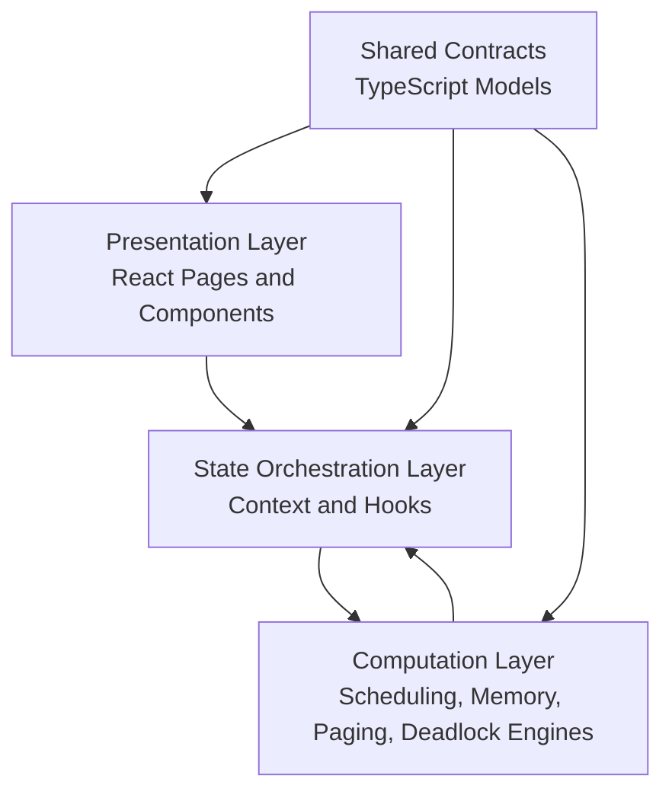
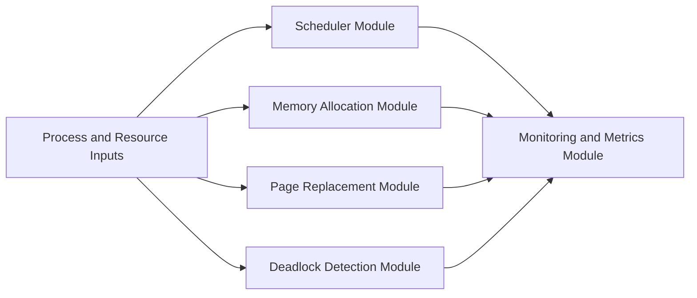
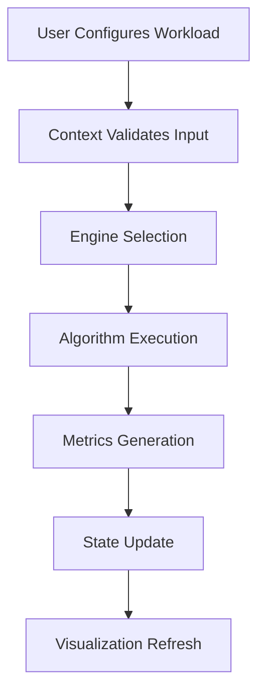
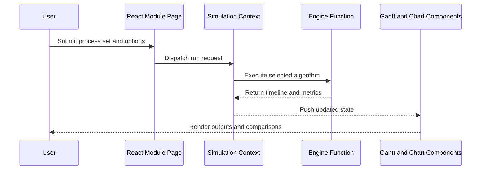

# ProcessOS - Architecture Documentation

## 1. Main Idea and Objective

ProcessOS is designed as a simulation-first learning platform where core operating system algorithms are executed deterministically and presented through responsive, interactive visual layers.

Architecture objectives:
- Separation of concerns across UI, state, and engine modules
- Predictable algorithm execution with testable outputs
- Strong type contracts for maintainability and scale

## 2. High-Level Architecture

## 3. Architecture Design Principles

- Deterministic computation: engines avoid UI coupling and side effects.
- Contract-first communication: model shapes are shared and typed.
- Composable UI: reusable components for rapid feature growth.
- Observability: algorithm outputs are converted into measurable visuals.

## 4. Core Layer Responsibilities

### Presentation Layer
- Route handling and module navigation
- Forms and simulation controls
- Visual representations: Gantt, charts, status panels

### State Orchestration Layer
- Holds canonical simulation inputs and outputs
- Mediates between user actions and engine execution
- Exposes ready-to-render state slices to components

### Computation Layer
- Executes algorithm implementations
- Produces metrics and timeline artifacts
- Encodes scheduling, allocation, replacement, and deadlock logic

### Shared Contract Layer
- Defines process, memory, and metrics models
- Prevents structural drift between modules

## 5. Module Architecture Map

## 6. Workflow and Control Flow

## 7. Execution Sequence (Detailed)

## 8. Data Flow Diagram

## 9. Module Responsibilities

| Module | Responsibility | Output |
|---|---|---|
| `src/engine/scheduler.ts` | CPU scheduling computations | Timeline, waiting/turnaround metrics |
| `src/engine/memory.ts` | Memory placement strategies | Allocation map, fragmentation insights |
| `src/engine/paging.ts` | Page replacement simulation | Hit/fault counts and ratios |
| `src/engine/deadlock.ts` | Safety and cycle analysis | Deadlock status and diagnostics |
| `src/context/SimulationContext.tsx` | State coordination | Shared simulation state |
| `src/components/*` | Visual rendering | Interactive charts, forms, tables |

## 10. Integration Details

- Routing integration: module pages mounted via `src/App.tsx`.
- State integration: pages consume context-driven simulation state.
- Engine integration: pure TypeScript functions called from context/hooks.
- Visualization integration: engine results mapped to reusable chart components.

## 11. Tech Stack and Rationale

| Technology | Role | Rationale |
|---|---|---|
| React | UI composition | Mature component model for dynamic views |
| TypeScript | Type safety | Prevents model mismatch and runtime surprises |
| Vite | Build and dev runtime | Fast startup and optimized production output |
| Tailwind + Radix | UI system | Consistent responsive primitives and speed |
| Chart.js + D3 | Data visualization | Practical rendering with transform flexibility |
| Vitest | Testing | Fast, modern testing workflow for TS projects |

## 12. Advantages, Benefits, and Trade-Offs

Advantages:
- Strong conceptual clarity for OS algorithms
- Clean modular boundaries
- Reliable developer workflow with lint/test/build checks

Benefits:
- Easy onboarding for students and interview demos
- Fast iteration on new algorithm modules
- Good foundation for future API-backed persistence

Trade-offs:
- Client-side scope limits persistence and collaboration
- Rich visualization layer increases component complexity

## 13. Scalability Path

## 14. Current Scope and Future Expansion

Current scope:
- Fully functional frontend simulator with tested algorithm engines

Future expansion:
- Backend API and database storage for scenario history
- Multi-user collaboration and shareable simulation sessions
