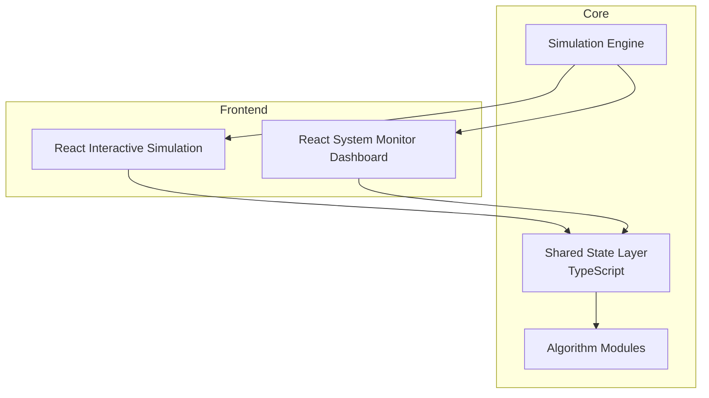
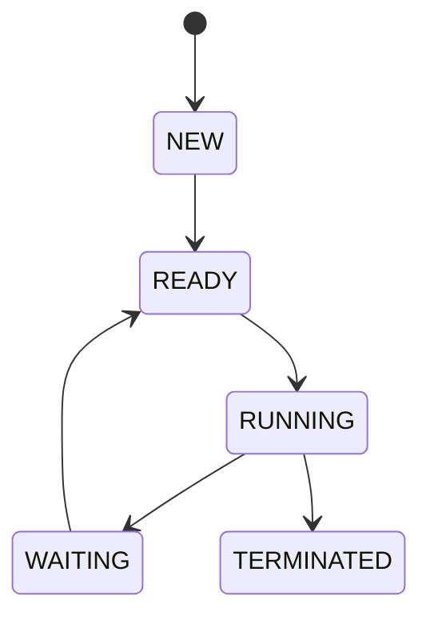
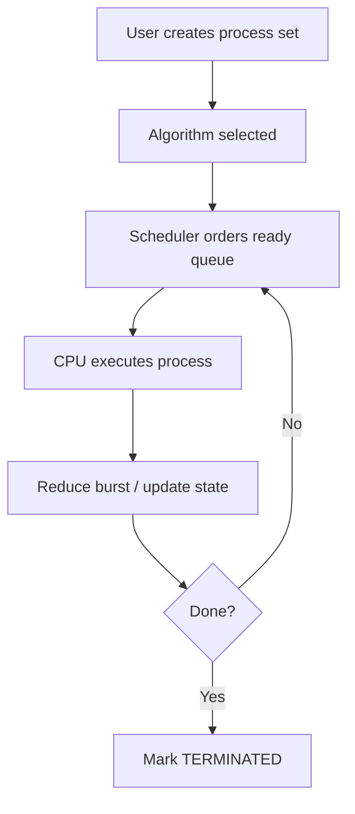
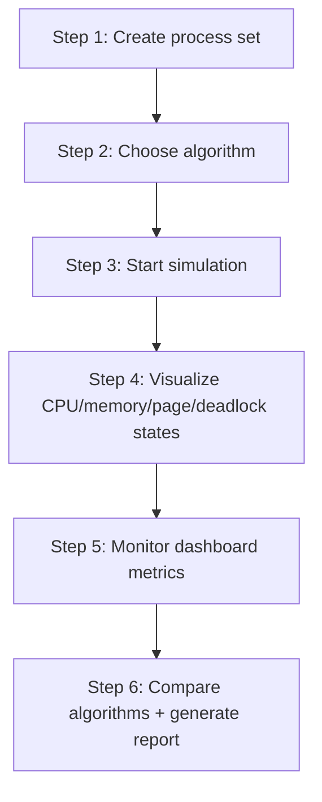
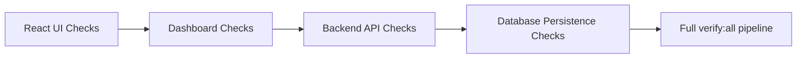
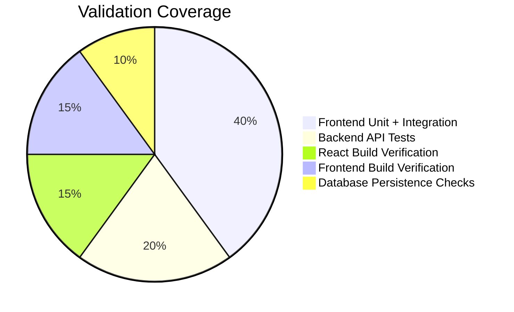

# ProcessOS - Project Documentation

## 1. Project Objective

Build an interactive operating system simulator where users can create processes, execute scheduling/memory algorithms, and monitor system behavior visually in real time.

The platform is intended for:

- OS learning and concept visualization
- Algorithm comparison and experimentation
- Demo-ready academic and interview portfolio use

## 2. Problem Statement

Traditional OS learning is often theory-heavy. Learners rarely see:

- Live CPU scheduling order
- Real-time process state transitions
- Memory fragmentation behavior
- Page replacement impact
- Deadlock formation and detection

ProcessOS addresses this through a live simulation architecture.

## 3. System Overview



## 4. Module-Wise Documentation

### 4.1 Process Manager

Responsibilities:

- Create process
- Edit process parameters
- Delete process
- Manage state transitions

Process attributes:

- PID
- Arrival Time
- Burst Time
- Priority
- Memory Requirement
- State

State machine:



Data structures:

- Queue
- Priority Queue

### 4.2 CPU Scheduling Engine

Algorithms:

- FCFS
- SJF
- Round Robin
- Priority Scheduling

Data structures:

- Queue
- Min Heap (SJF)
- Circular Queue (RR)
- Priority Queue

Execution flow:



### 4.3 Gantt Chart Visualizer (React)

Features:

- Live timeline updates
- Color-coded process blocks
- Time quantum animation
- Step-by-step playback

Rendering options:

- Canvas API
- SVG

Frame cadence target:

- `500ms` update interval

### 4.4 Memory Allocation Simulator

Algorithms:

- First Fit
- Best Fit
- Worst Fit

Visual output example:

```text
|P1|P2|Free|P3|Free|P4|
```

Metrics:

- Fragmentation
- Allocation failure count
- Used vs free memory

### 4.5 Page Replacement Engine

Algorithms:

- FIFO
- LRU
- Optimal

Metrics:

- Total references
- Page faults
- Hit ratio
- Fault ratio

### 4.6 Deadlock Detection System

Approach:

- Banker's algorithm
- Resource allocation graph cycle detection
- DFS traversal

Graph representation:

```text
Process -> Resource -> Process
```

Deadlock handling options:

- Process termination
- Resource preemption

## 5. System Monitor Dashboard

Dashboard modules:

- Process table (PID, state, CPU%, memory)
- CPU utilization graph (time vs utilization)
- Algorithm comparison panel

Comparison metrics:

- Avg waiting time
- Avg turnaround time
- CPU utilization
- Throughput

## 6. End-to-End Workflow



## 7. Algorithms Summary

| Feature | Algorithms |
|---|---|
| Scheduling | FCFS, SJF, Round Robin, Priority |
| Memory | First Fit, Best Fit, Worst Fit |
| Virtual Memory | FIFO, LRU, Optimal |
| Deadlock | Banker's Algorithm |
| Graph Detection | DFS Cycle Detection |

## 8. Tech Stack

Frontend:

- React (simulation UI)
- TypeScript
- Canvas API
- Chart.js / D3.js

Backend (recommended):

- Node.js
- Express
- REST API

Implemented backend in this repository:

- TypeScript Express API (`backend/`)
- SQLite persistence (`backend/data/processos.db`)
- Request validation via Zod

## 9. Folder Organization (Reference Design)

```text
processOS/
  frontend-react/
    components/
    gantt-chart/
    scheduler/
    memory-visualizer/
    deadlock-graph/

  core-engine/
    scheduling/
    memory/
    deadlock/
    paging/

  shared/
    models/
    types/
```

## 10. SDLC Strategy

1. Requirement phase: define simulation scope and module boundaries.
2. Design phase: architecture, state contracts, UI flows.
3. Implementation phase: algorithms, simulators, visual dashboards.
4. Testing phase: unit + integration + scenario validation.
5. Iteration phase: improve performance, UI polish, algorithm depth.

## 11. Testing and Validation Plan

Critical test scenarios:

- Round Robin correctness under varying quantum.
- Deadlock detection correctness for cyclic/non-cyclic graphs.
- Page replacement fault/hit accuracy for reference strings.
- Memory allocation correctness and fragmentation behavior.
- Process lifecycle transition correctness.

Validation checks:

- Numeric input validation and bounds
- Safe state updates
- Failure message clarity
- End-to-end flow stability

## 12. Verification Checklist

- All modules are integrated without flow breaks.
- UI remains responsive across mobile/tablet/desktop.
- No critical crashes during simulation scenarios.
- Metrics and visual outputs stay consistent with algorithm outputs.
- Test suite passes and build is successful.

## 13. Advantages and Trade-Offs

Advantages:

- Strong OS and DSA demonstration
- High visualization and UI value
- Clear architecture and modularity
- Interview and resume impact

Trade-offs:

- Increased complexity from multi-module full-stack integration
- Strong need for strict shared-state contracts

## 14. Advanced Features (Future Enhancements)

- Multi-core CPU simulation
- Cloud deployment (Vercel/Netlify)
- Exportable PDF/CSV reports
- Collaborative simulation rooms

## 15. Setup and Execution

```bash
npm install
npm run dev
npm run test
npm run build
npm run backend:build
```

## 16. Configuration and Dependency Notes

Current local configuration:

- No runtime environment variables required.
- React app and simulation engines run client-side.
- Monitoring views are delivered within React dashboard modules.
- Backend uses local SQLite file database by default.

Dependency highlights:

- React + TypeScript + Vite
- Canvas API for timeline rendering
- Chart.js + D3 for monitoring visualization
- Express + SQLite for persistence-backed APIs

## 17. Backend + Database Module Details

Primary backend components:

- `backend/src/server.ts`: API server bootstrap.
- `backend/src/app.ts`: route registration and request handling.
- `backend/src/db.ts`: SQLite initialization and schema creation.
- `backend/src/engine/scheduler.ts`: server-side scheduling execution.

Database schema:

- `scenarios` table stores process set definitions.
- `simulation_runs` table stores execution requests and computed outputs.

API routes:

- `GET /health`
- `GET /api/scenarios`
- `GET /api/scenarios/:id`
- `POST /api/scenarios`
- `POST /api/simulations/run`
- `GET /api/simulations`

## 18. End-to-End Validation Playbook

1. Start React simulator and verify route navigation.
2. Add/edit/remove processes and confirm state transitions.
3. Run FCFS/SJF/RR/Priority and validate metrics rendering.
4. Verify memory allocation behaviors (first/best/worst fit).
5. Verify page replacement outputs (FIFO/LRU/Optimal).
6. Validate deadlock checker (banker + graph cycle check).
7. Start backend and verify `/health` + simulation endpoints.
8. Run full verification pipeline.



Acceptance criteria:

- No crash on normal or edge-case user actions.
- Deterministic algorithm outputs for fixed inputs.
- UI feedback for all invalid inputs.
- Successful test and build pipelines.
- Backend API responses are valid and persisted records are retrievable.

## Verification Coverage Chart



## 19. Production Readiness Criteria

- Stable modular architecture with clear ownership per layer.
- Verified CI-ready commands for test and build.
- Documentation completeness across onboarding, architecture, and operations.
- Backend/database integration implemented and verified.

## 20. Resume-Ready Project Summary

**ProcessOS - Interactive Operating System Simulator**

Tech Stack: React, TypeScript, Canvas API

- Built an interactive OS simulator for CPU scheduling, memory allocation, page replacement, and deadlock analysis.
- Implemented FCFS, SJF, Round Robin, and Priority scheduling with queue-based data structures.
- Developed animated timeline visualizations for process execution behavior.
- Designed system monitoring dashboards for CPU/memory metrics and algorithm comparison.

## 21. Final Notes

This documentation is structured to present ProcessOS as a complete, architecture-first system with clear module boundaries, execution flow, and extension paths for production and hackathon-ready deployment.
