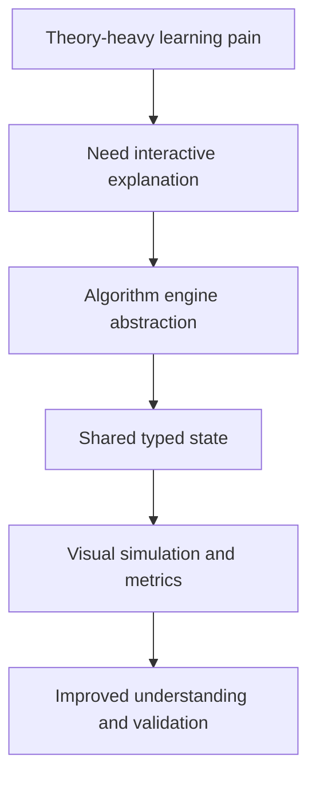
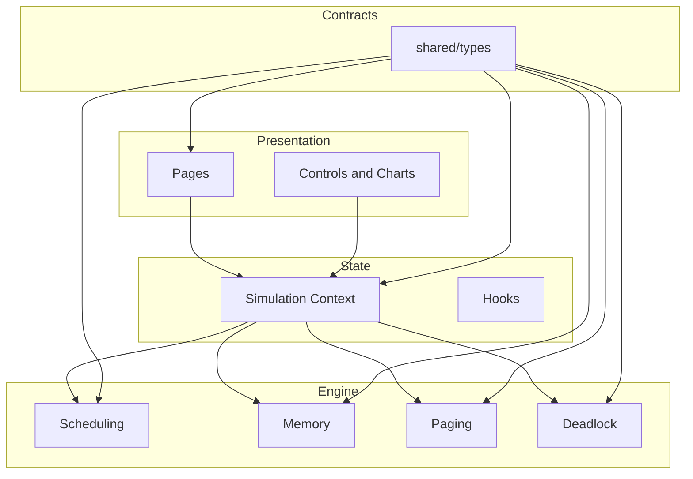
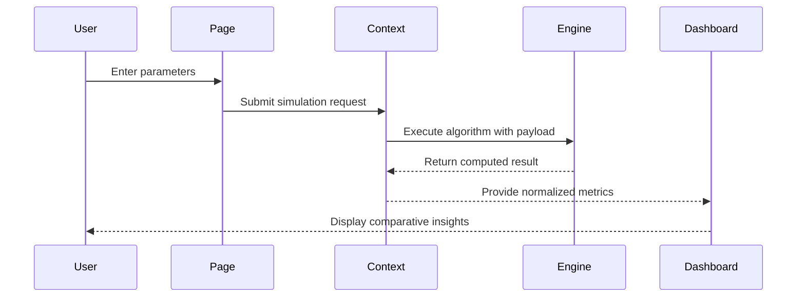
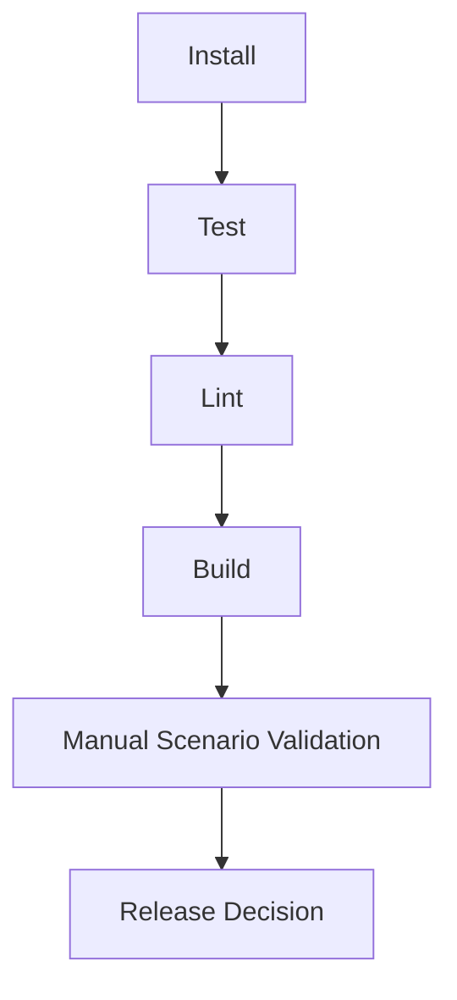

# ProcessOS - Project Documentation

## 1. Main Idea and Objective

ProcessOS is an educational and engineering-focused simulator for core operating system concepts.

Primary objectives:
- Convert abstract OS algorithms into interactive visual experiences
- Deliver reliable algorithm outputs with deterministic behavior
- Provide a professional, extensible codebase suitable for real project portfolios

## 2. Problem-Solving Approach

Common challenge:
- OS concepts are usually taught theoretically, with low visual intuition.

Approach used in ProcessOS:
- Isolate algorithms into pure computation modules.
- Route all user actions through a controlled state layer.
- Render outputs with reusable visualization components.
- Validate behavior with automated tests and build checks.



## 3. System Architecture and Design



## 4. Key Modules and Responsibilities

| Module | Responsibility | Integration Touchpoints |
|---|---|---|
| Process Input Layer | Captures workload definitions | Forms, context actions |
| Scheduling Engine | Computes CPU execution order and metrics | Gantt and metrics panels |
| Memory Engine | Simulates allocation policies | Memory visualizer |
| Paging Engine | Simulates replacement policy outcomes | Paging visualizer and stats |
| Deadlock Engine | Evaluates safety/cycle conditions | Deadlock detector views |
| Dashboard Layer | Aggregates and compares outputs | Charts and health panels |

## 5. Workflow Explanation


## 6. Data Flow and Execution Flow



## 7. Tech Stack and Why It Was Chosen

| Technology | Purpose | Selection Reason |
|---|---|---|
| React | UI composition | Flexible and component-driven |
| TypeScript | Reliability | Static type guarantees across modules |
| Vite | Build and dev speed | Fast feedback loop and optimized bundling |
| Tailwind + Radix + shadcn | UI consistency | Rapid, accessible, reusable primitives |
| Chart.js + D3 | Visualization | Reliable charting with transformation support |
| Vitest + Testing Library | Testing | Modern and lightweight for React TS projects |
| ESLint | Static quality | Standardized code quality enforcement |

## 8. Code Structure and Organization

```text
src/
  components/
    AlgorithmComparison.tsx
    AnimatedGantt.tsx
    MemoryVisualizer.tsx
    PageReplacementVisualizer.tsx
    DeadlockDetector.tsx
    SystemMonitorPanel.tsx
  context/
    SimulationContext.tsx
  engine/
    scheduler.ts
    memory.ts
    paging.ts
    deadlock.ts
  pages/modules/
    HomePage.tsx
    SchedulingPage.tsx
    MemoryPage.tsx
    PagingPage.tsx
    DeadlockPage.tsx
    DashboardPage.tsx
  test/
    scheduler.test.ts
    memory.test.ts
    process-form.test.tsx
shared/types/
  simulation.models.ts
```

## 9. Crucial Components and Integration Details

- `SimulationContext` is the orchestration core between UI and engines.
- Engine modules are pure TypeScript and independently testable.
- Visual components read normalized state and avoid owning business logic.
- Route-based module separation keeps features decoupled and maintainable.

## 10. Advantages, Benefits, Pros, and Cons

Pros:
- High educational clarity through visual execution
- Strong architecture boundaries and code readability
- Deterministic algorithm behavior with tests

Benefits:
- Good for interview demos and academic presentations
- Easy to extend with new algorithms
- Fast local development and verification cycles

Cons:
- Frontend-only scope currently lacks persistence
- Visualization complexity increases UI maintenance effort

## 11. Setup and Execution Instructions

### Prerequisites
- Node.js `>=18`
- npm `>=9`

### Installation

```bash
npm install
```

### Run Locally

```bash
npm run dev
```

### Validate Project

```bash
npm run test
npm run lint
npm run build
npm run verify:all
```

## 12. Validation and Testing Strategy

Automated validation:
- Unit tests for algorithm engines
- Component-level UI behavior tests
- Lint and build gate checks

Manual validation:
1. Test all module routes.
2. Run each scheduling algorithm on the same workload.
3. Validate memory and paging edge cases.
4. Validate deadlock safe and unsafe scenarios.
5. Confirm responsiveness across mobile and desktop viewports.

## 13. Verification Workflow Diagram



## 14. Risk and Mitigation Summary

| Risk | Impact | Mitigation |
|---|---|---|
| Algorithm/UI mismatch | Incorrect visual interpretation | Shared typed models + test assertions |
| Regression after feature updates | Broken user flows | `verify:all` pipeline in development cycle |
| Performance drop with rich visuals | Reduced UX quality | Route-level lazy loading and modular charts |

## 15. Current Scope and Extension Plan

Current implemented scope:
- Frontend simulator with complete algorithm modules and visuals

Extension roadmap:
- Backend API for scenario persistence
- Database-backed simulation history
- Shared reports and collaboration flows
